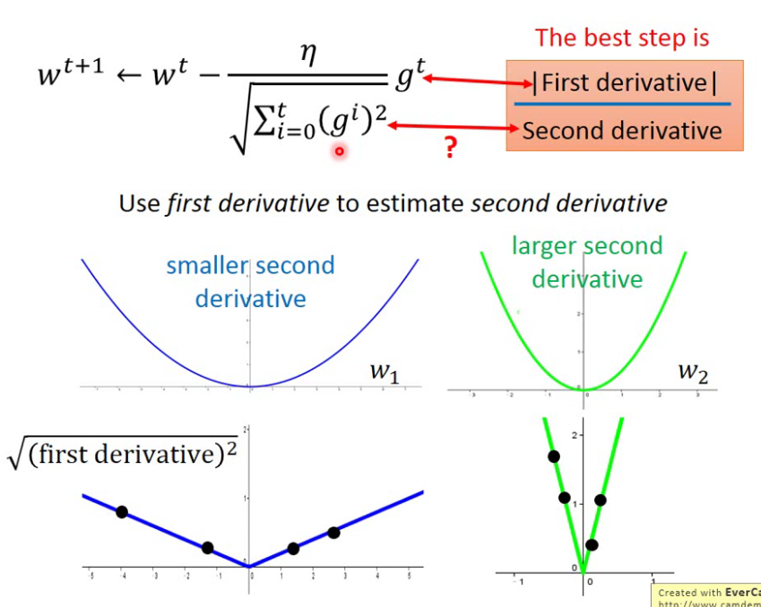

## Loss function

$$
L=\sum_n\left(y^n- \left(b+\sum w_ix_i^n\right)\right)^2
$$

## Vanilla gradient Descent :

$$
w^{t+1}=w^t-\eta^tg^t\space\space\space\space\space\space\space\space\space[\eta\to lr;g\to gradient]\\
\begin{cases}
\eta^t=\frac{\eta}{\sqrt{t+1}}\space\space\space\space\space\space\space\space\space\space\space  \eta \space is \space learning \space rate\\
g^t=\frac{\partial L(\theta^t)}{\partial w^t}\space\space\space\space\space\space\space\space\space L(\theta^t)\space is\space the\space loss\space function
\end{cases}
$$

## Ada gradient Descent:

$$
w^{t+1}=w^t-\frac{\eta^t}{\rho^t}g^t\\
$$

root mean square of its previous derivatives [ history dradient ]
$$
\rho^t=\sqrt{\frac{1}{t+1}\sum^t_{i=0}(g^i)^2}
$$
1/t can decay as:
$$
w^{t+1}=w^t-\frac{\eta}{\sqrt{\sum^t_{i=0}(g^i)^2}}g^t\\
$$

## Stochastic gradient descent(SGD)

$$
w^{t+1}=w^t-\eta^tg^t
$$

g_t is mean:
$$
g^t=\frac{\partial L_{i_s}(w^t,x^{(i_s)},y^{(i_s)})}{\partial w^t};\space \space \space \space \space \space \space \space i_s\in {[1,2,...,n]}\space is \space random \space gradient\space direction
$$
add some random voice in output:
$$
E(g^t)=\frac{\partial L_{i_s}(w^t)}{\partial w^t}
$$

## Batch Gradient Descent(BGD)

$$
w^{t+1}=w^t-\eta_t\sum^n_{i=1}g^{t^{(i)}}
$$

here have different gradient:
$$
\sum^n_{i=1}g^{t^{(i)}}=\sum^n_{i=1}\frac{\partial L_i(w^t,x^{(i)},y^{(i)})}{\partial w^t}
$$

## Momentum-SGD

central mind: Introduce listoric gradient standard-info momentum into accelerating SGD

extract n-size mini-batch sample{[X1,X2,...,Xn],[Y1,Y2,...,Yn]}from train-data.

the formula of Momentum optimal:
$$
\begin{cases}
v_t=\alpha v_{t-1}+\eta_t\frac{\partial L_i(w^t,x^{(i)},y^{(i)})}{\partial w^t}\\
\\
w_{t+1}=w_t-v_t
\end{cases}
$$
