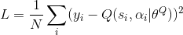
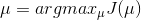

# DEEP REINFORCEMENT LEARNING

#### Action and Observation

#### Reward

## DQN (select in Discrete)

### Fixed Q-Targets 

[ Target_net (update late)----> detect, Eval_net ----> act (update opportune) ]

## POLICY GRADIENTS (select in Continuous)

In here , i need explain the formula:

Classic method in Continuous action: **Propability Distribution Function**

## Actor Critic (PG + Q-Learning)

### Actor---->Policy Gradient 

Actor select a suitable action from continuous action which come from Neural Network by **certain propability**.

### Critic---->Q-Learning

after actor selected a suitable action, critic use **[ s, s_ ]** to compute **[ v, v_ ]** by Neural Network. then using this formula:

single update the actor network by [ **td, s, action** ]
## Deep Deterministic Policy Gradient

PG -> DPG -> DDPG

### DPG [a new function]

The Function u is **the most optimal policy**[ combine Q-learning or Gradient Q-learning ],  It is no longer a random strategy that requires sampling.[ PG is random sampling ]

### DDPG

DDPG is belong to **Actor-Critic**, output is **a specific action**, it isn't the propability of a series of action. it benefit for detect from continuous action. and DDPG successfully **combine DQN and Action-Critic**. Enhance stability and convergence of AC. 

maybe it mean that [ **Deep + Deterministic + Policy Gradient** ]

#### Actor

**gradient[Q]** is come from **Critic**, it tall Actor How to move and get the more reward. Critic get this value by **s**(<u>the last observation</u>) and **action**(<u>which was compute from neural network</u>)

**grdient[U]** is from **Actor**, it help actor **fix himself parameter** so that actor will choose this big reward action in next time.

#### Critics

According to **s_,** using Actor select **action**( **Actor_Target** ), [ **Directly output** the action by Neural NetWork.

Update critic by **minimizing the loss**: 

#### Outline

##### A certain action policy u : every action from [ Actor ]

##### Policy network : simulate function u with convolution neural network. the name of parameter is  [ Actor ]

##### Behavior policy :  we should focus on Exploration and **Exploit**   [ Actor ]

Exploration: explorate the hidden optimal policy. so we add some random voice in action decision[ actor_eval ].

this policy is Behavior policy. the training mode is Off-policy.

DDPG use [Uhlenbeck-Ornstein random process](https://en.wikipedia.org/wiki/Ornstein%E2%80%93Uhlenbeck_process). 

**This Behavior policy isn't  the optimal policy**. it just **generate** action so that we can get the training data, such as **transitions** and **trajectory** of agent. finally, we can use this data to train policy and get the optimal policy. 

##### Test and Evaluation [ Critic ]

we use **the certain action policy** to test , not behavior policy .[ because the aim of behavior policy is find the other probability optimal policy ]

Q-function : In the state St , take action (at) under the certain action policy, then get the expect value Rt, explain it by Bellman formula :

it is hard to recursion calculate Q, so we use a nerual network to simulate this formula.[Q-Network]

this method like DQN;

##### J function measure this policy performance [ performance objective ]

s is the state，This state is base on agent behavior policy : the distribution function is *ρ^β*

*Q^μ*(*s*,*μ*(*s*)) is the Q-value which are producted by certain policy [ *μ* ] 

Train aim：maximum [ *J_β*(*μ*) ] and minimize [ *Q* ]

the most optimal action policy : maximum J_β(μ):

#### In the code:DDPG divide into 2 network[policy{actor} and Q{critic}]

each round(min-batch) update eval-net then update target-net using SGA\SGD

update target-net is runing average algorithm:

# Classification

### Model-free  and Model-based

### Probability-based and Value-based

### Monte-Carlo update and Single update

### On-Policy and Off-Policy

### action can be splited as: Discrete and Continuous

### Monte-Carlo update and Single update

### On-Policy and Off-Policy

### action can be splited as: Discrete and Continuous