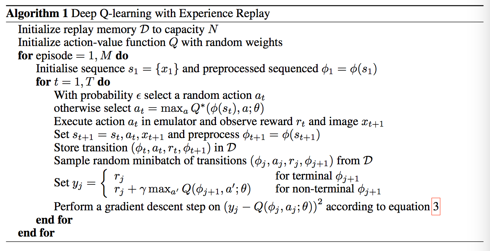

# DEEP REINFORCEMENT LEARNING

#### Action and Observation

#### Reward

)

## DQN (select in Discrete)

### Fixed Q-Targets 

[ Target_net (update late)----> detect, Eval_net ----> act (update opportune) ]

## POLICY GRADIENTS (select in Continuous)

Classic method in Continuous action: **Propability Distribution Function**
 )

## Actor Critic (PG + Q-Learning)

### Actor---->Policy Gradient 

Actor select a suitable action from continuous action which come from Nerual Network by **certain propability**.

### Critic---->Q-Learning

after actor selected a suitable action, critic use **[ s, s_ ]** to compute **[ v, v_ ]** by Nerual Network. then using this formula:

single update the actor network by [ **td, s, action** ]
## Deep Deterministic Policy Gradient

PG -> DPG -> DDPG

### DPG [a new function]:

)

DDPG is belong to **Actor-Critic**, output is **a specific action**, it isn't the propability of a series of action. it benefit for detect from continuous action. and DDPG successfully **combine DQN and Action-Critic**. Enhance stability and convergence of AC. 

maybe it mean that [ **Deep + Deterministic + Policy Gradient** ]

### Actor

|_{s=s_i,\alpha=\mu(s_i)}\nabla_{\theta^{\mu}\mu}(s|\theta^\mu)|s_i)

**gradient[Q]** is come from **Critic**, it tall Actor How to move and get the more reward. Critic get this value by **s**(<u>the last observation</u>) and **action**(<u>which was compute from nerual network</u>)

**grdient[U]** is from **Actor**, it help actor **fix himself parameter** so that actor will choose this big reward action in next time.

### Critics

| \theta^{Q'}))

According to **s_,** using Actor select **action**( **Actor_Target** ), [ **Directly output** the action by Nerual NetWork.

Update critic by **minimizing the loss**: 

)^2)

# Classification

### Model-free  and Model-based

### Probability-based and Value-based

### Monte-Carlo update and Single update

### On-Policy and Off-Policy

### action can be splited as: Discrete and Continuous