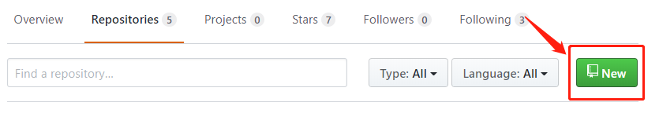
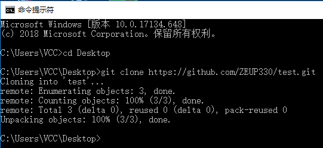
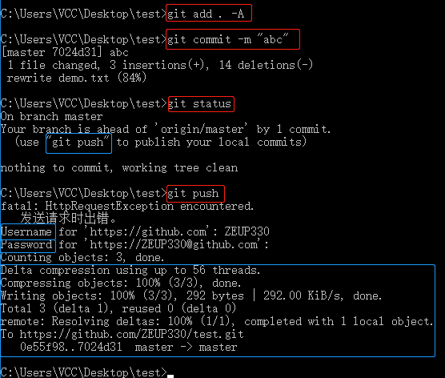
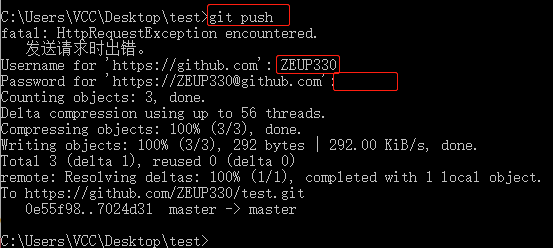

# Github Command #
在日常开发中，由于采用 Git 作为版本控制，经常跟命令行打交道，这是一些简单的使用流程，方便回顾。

## 安装Git ##
### 在Linux上安装Git ###
    sudo apt-get install git
### 在Windows上安装Git ###
请移步到Git官网下载[安装程序](https://git-scm.com/downloads)，网速慢的可以尝试[国内镜像](https://pan.baidu.com/s/1kU5OCOB#list/path=%2Fpub%2Fgit)，默认安装即可。
## 用户认证 ##
安装完成后，还需要最后一步设置，在命令行输入：

	git config --global user.name "Your Name"
	git config --global user.email "email@example.com"

## 创建一个远程仓库 ##
在你的github页面上找到Repositories,并点击new创建一个新的远程仓库：

后续的操作很简单，主要是设置repository的名字和是否public以及是否initialize README.md;所以就不贴图了.

## 创建一个本地仓库 ##
输入command：

	git clone https://github.com/ZEUP330/test.git

## 提交更改 ##
提交更改后（例如我是新建了一个demo.txt文件），输入命令:

	git add . -A
	git commit -m "write what you want"
	git status

现在显示本地没有改变，远程的github与本地不同步了，本地有一个更新，就是我们新加的2行，但是github并没有更新。
## 推送到远程仓库 ##

现在我们点击push便可以把本地仓库展示到远程仓库上。

ps1：if you meet this：
> fatal: HttpRequestException encountered.
   发送请求时出错。

you don't need to mind it

