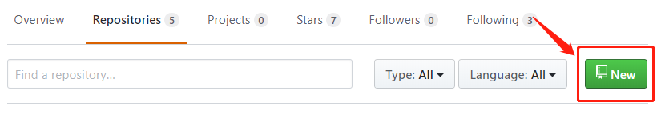
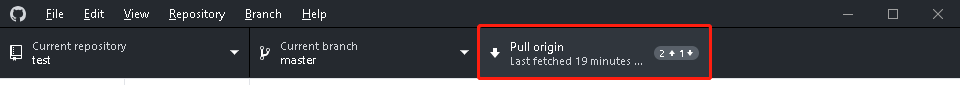

# Github Desktop（Windows） #
这是Github的官方git软件，其实现在很多IDE都自带这种版本控制软件，学会了这个其他的版本控制软件上手就很简单了，这篇文章我只会分享自己常用的一些操作。

## 界面介绍 ##
如果你打开这个[软件](https://desktop.github.com/)后，会发现应该如下所示。 左边的是可以切换添加进来的仓库，再也不需要cd来cd去了，白色框内是改变提醒，下面是提交修改。所以整个工作流程是有修改直接commit就行了。

## 创建一个远程仓库 ##
在你的github页面上找到Repositories,并点击new创建一个新的远程仓库：

后续的操作很简单，主要是设置repository的名字和是否public以及是否initialize README.md;所以就不贴图了.
## 创建一个本地仓库 ##
好了，现在我们直接在我的github上面克隆一个仓库并且在桌面打开，这个仓库已经初始化好了，所以不需要任何命令

将鼠标停放在Current Repository上可以看到本地仓库地址。
## 提交更改 ##
提交更改后（例如我是新建了一个demo.txt文件），在Github Desktop中可以看到变化。

图上红色框区域为变化的，而黄色区域为需要提交的commit。之后点击commit to master便完成了本地仓库的改变。

现在显示本地没有改变，但是上面push origin显示了1，代表的是我们与远程的github不同步，本地有一个更新，就是我们新加的2行，但是github并没有更新。
## 推送到远程仓库 ##

现在我们点击push便可以把本地仓库展示到远程仓库上。

ps1：if you meet this:
> fatal: refusing to merge unrelated histories

you can try this command in you cmd:

    git pull origin master --allow-unrelated-histories

