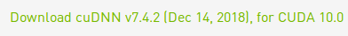

#  Install Pytorch GPU 

## Install Nvidia driver on Ubuntu14

### Open System settings 

### Software & Updatas

### Addition Drivers

choice the using NVIDIA binary driver-version 384.183 from nvidia-384

then reboot the computer

### Try nvidia-smi

## Download Cuda-8

visit [*Offical* *Website*](https://developer.nvidia.com/cuda-downloads) 

## Installation Installer

​	`sudo dpkg -i cuda-repo-ubuntu1404_10.1.105-1_amd64.deb`

​	`sudo apt-key adv --fetch-keys http://developer.download.nvidia.com/compute/cuda/repos/ubuntu1404/x86_64/7fa2af80.pub`

​	`sudo apt-get update`

​	`sudo apt-get install cuda-8-0`

### Download Cudnn

it also need to visit [*Offical website*](https://developer.nvidia.com/cudnn)

Choose it

click the link

### Install Cudnn-6

use command:

​	sudo dpkg -i libcudnn6_6.0.21-1+cuda8.0_amd64.deb

​	sudo apt-get install libcudnn6

## Install Pytorch-GPU

[*offical website*](https://pytorch.org/)

# Try your Torch

