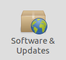
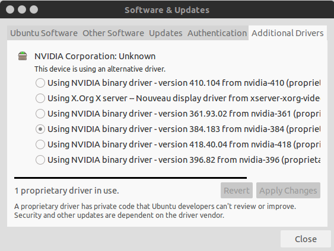
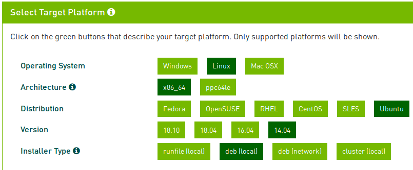

#  Install Pytorch GPU 

due to some problem of my pytorch , i need use cuda10.1 and cudnn7.4.2

so delete my cuda8 and cudnn6,let do it.

## Uninstall cuda-8 and cudnn-6

```shell
sudo apt-get remove cuda-8-0

sudo apt-get autoclean

sudo apt-get remove cuda*

cd /usr/local/

sudo rm -r cuda-8.0

sudo rm -rf /usr/local/cuda/include/cudnn.h

sudo rm -rf /usr/local/cuda/lib64/libcudnn*
```

## Install Nvidia driver on Ubuntu14

### Open System settings 


### Software & Updatas



### Addition Drivers



choice the using NVIDIA binary driver-version 384.183 from nvidia-384

then reboot the computer

### Try nvidia-smi


## Download Cuda-8

visit [*Offical* *Website*](https://developer.nvidia.com/cuda-downloads) 



## Installation Installer

```shell
sudo dpkg -i cuda-repo-ubuntu1404-10-1-local-10.1.105-418.39_1.0-1_amd64.deb
sudo apt-key add /var/cuda-repo-<version>/7fa2af80.pub
sudo apt-get update
sudo apt-get install cuda
```
maybe you can use this ftp server to find the appropriate file.
```
ftp://172.31.238.122
```
### Download Cudnn

it also need to visit [*Offical website*](https://developer.nvidia.com/cudnn)


Choose it


click the link


### Install Cudnn-6

use command:

```shell
sudo dpkg -i libcudnn7_7.5.0.56-1+cuda10.1_amd64.deb

sudo apt-get install libcudnn7
```

## Install Pytorch-GPU

[*offical website*](https://pytorch.org/)


# Try your Torch

### In the terminal
```shell
ipython
```
input this code:
```python
import torch
torch.cuda.is_available()
```
if you get the result that:
```python
True
```

It mean that you torch can use GPU